# Provenance Representation: Student Financial Support Survey

This repo contains a practical exercise in modeling provenance using the PROV standard.
The goal is to represent the lifecycle of a research paper, from the initial survey design to the final publication, tracking all agents, activities, and entities involved.

Laura designs a survey about student
financial support
• Jack and Jill conduct the survey and
collect data
• A year later, Laura revises the survey
• Peter and Paula conduct the survey and
collect data
• Zack compiles all the survey results,
analyzes them with a statistics package,
and publishes a paper with Laura and
other co-authors

```mermaid
graph TD
    %% Define Shapes
    classDef entity fill:#FFD700,stroke:#333,stroke-width:2px,rx:20,ry:20;
    classDef activity fill:#87CEFA,stroke:#333,stroke-width:2px;
    classDef agent fill:#FFA07A,stroke:#333,stroke-width:2px;

    %% Entities (Ovals)
    sv1([e:Survey V1]):::entity
    sv2([e:Survey V2]):::entity
    d1([e:Data 1]):::entity
    d2([e:Data 2]):::entity
    comp([e:Compiled Results]):::entity
    paper([e:Paper]):::entity

    %% Activities (Rectangles)
    design[a:Design Survey]:::activity
    cond1[a:Conduct Survey 1]:::activity
    rev[a:Revise Survey]:::activity
    cond2[a:Conduct Survey 2]:::activity
    analyze[a:Compile & Analyze]:::activity
    pub[a:Publish]:::activity

    %% Agents (Pentagons)
    laura{{ag:Laura}}:::agent
    jack{{ag:Jack}}:::agent
    jill{{ag:Jill}}:::agent
    peter{{ag:Peter}}:::agent
    paula{{ag:Paula}}:::agent
    zack{{ag:Zack}}:::agent
    stat{{ag:Stat Package}}:::agent
    coauth{{ag:Co-Authors}}:::agent

    %% Use and Generation
    design -->|generates| sv1
    cond1 -->|uses| sv1
    cond1 -->|generates| d1
    rev -->|uses| sv1
    rev -->|generates| sv2
    cond2 -->|uses| sv2
    cond2 -->|generates| d2
    analyze -->|uses| d1
    analyze -->|uses| d2
    analyze -->|generates| comp
    pub -->|uses| comp
    pub -->|generates| paper

    %% Revision & Derivation
    sv2 -.->|wasRevisionOf| sv1
    comp -.->|wasDerivedFrom| d1
    comp -.->|wasDerivedFrom| d2
    paper -.->|wasDerivedFrom| comp

    %% Agents & Plans
    design -.- laura
    cond1 -.- jack
    cond1 -.- jill
    cond1 -.->|wasAssociatedWith PLAN| sv1
    rev -.- laura
    cond2 -.- peter
    cond2 -.- paula
    cond2 -.->|wasAssociatedWith PLAN| sv2
    analyze -.- zack
    analyze -.- stat
    pub -.- zack
    pub -.- laura
    pub -.- coauth
```

---
# Metadata
* **`LICENSE`**: This project is licensed under MIT License.
* **`CITATION.cff`**: Citation information.
* **`codemeta.json`**: Metadata about the software (just as an exercise).
* **`DOI`**: https://doi.org/10.5281/zenodo.18868387
